# Week 2: Setting Up and Running CKB Locally

This week focused less on theory and more on execution: setting up OffCKB, running a local devnet, and compiling/deploying a first contract.

---

## OffCKB Setup

OffCKB is a local CKB development environment manager. Similar to Hardhat/Foundry in the Ethereum ecosystem, it handles most bootstrapping tasks:

- Downloads the CKB binary automatically
- Starts a local devnet
- Provides 20 pre-funded test accounts
- Pre-deploys common scripts (e.g., Omnilock and xUDT) in genesis

Install command:

```bash
npm install -g @offckb/cli
```

Important note: install with `npm`, not Bun. Bun caused a native module "Cannot find module" issue in my setup.

Start local devnet:

```bash
offckb node
```

On first run, OffCKB downloaded the missing CKB binary and started successfully. RPC proxy was available at `http://127.0.0.1:28114`.

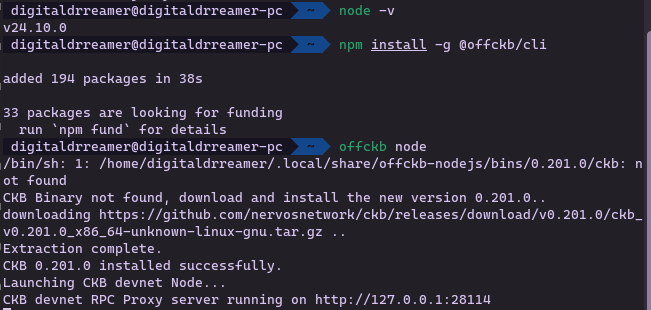

Account check:

```bash
offckb accounts
```

The 20 pre-funded accounts appeared as expected.

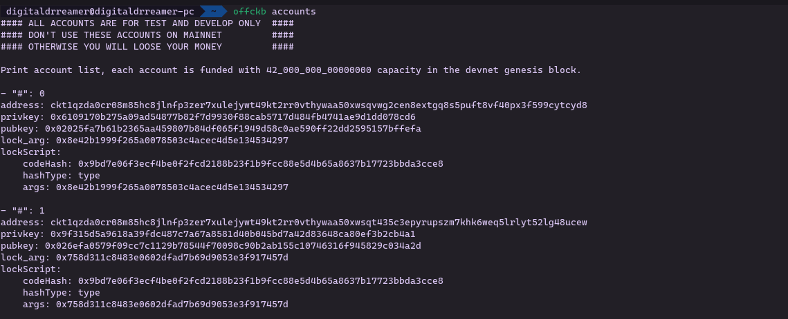

---

## Project Scaffold

Created a new project with:

```bash
offckb create my-first-ckb-project
```

Using the script template generated a Rust/JavaScript hybrid project structure with a `hello-world` contract in the contracts directory.

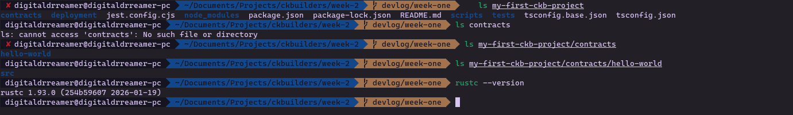

---

## Build Pipeline Notes

CKB contract development here is not Solidity-based. The template workflow uses TypeScript/JavaScript tooling and compiles output to RISC-V-compatible bytecode for CKB-VM execution.

Build command:

```bash
npm run build
```

Two dependencies initially blocked the build:

1. Missing `cargo-generate`
2. Clang version too old (system had Clang 14; pipeline required Clang 16)

Error evidence:

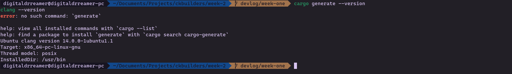

Installed `cargo-generate`:

```bash
cargo install cargo-generate
```

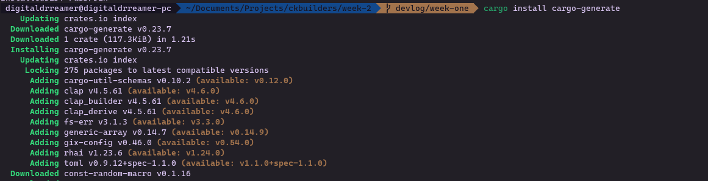

Installed Clang 16 from LLVM repo:

```bash
wget https://apt.llvm.org/llvm.sh
chmod +x llvm.sh
sudo ./llvm.sh 16
```

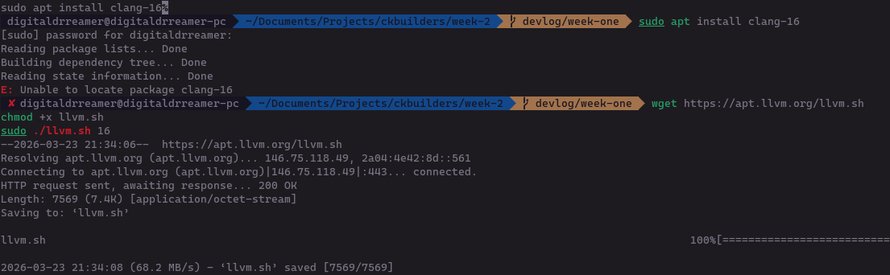

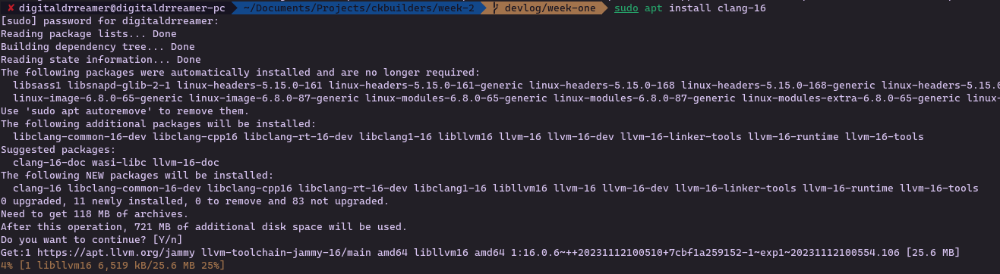

After fixing both dependencies, build succeeded and produced `.js` and `.bc` artifacts for each contract.

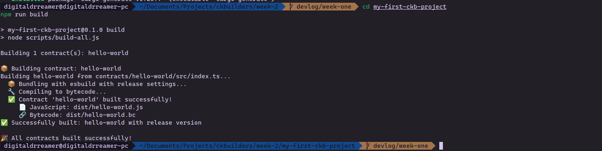

---

## Testing and Deployment

Initial test run:

```bash
npm test
```

There were two suites:

- **Mock tests** passed immediately (simulated environment, no live node dependency)
- **Devnet tests** failed first due to missing deployed script references (`hello-world.bc` not found in scripts index)

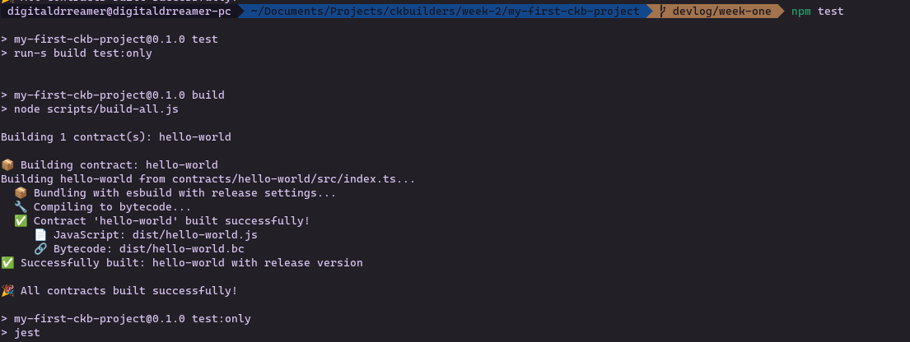

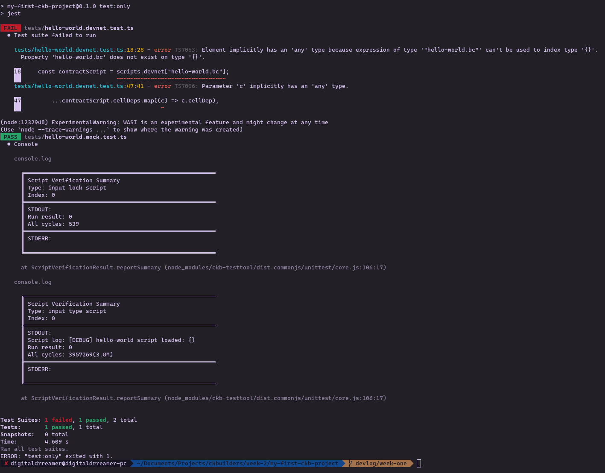

Root cause: contract not deployed yet, so deployment config was empty.

With devnet running in another terminal, deployment succeeded:

```bash
npm run deploy
```

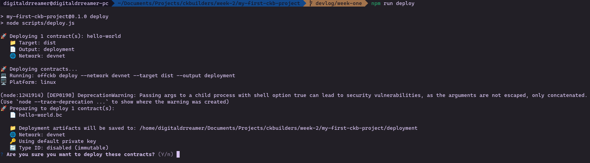

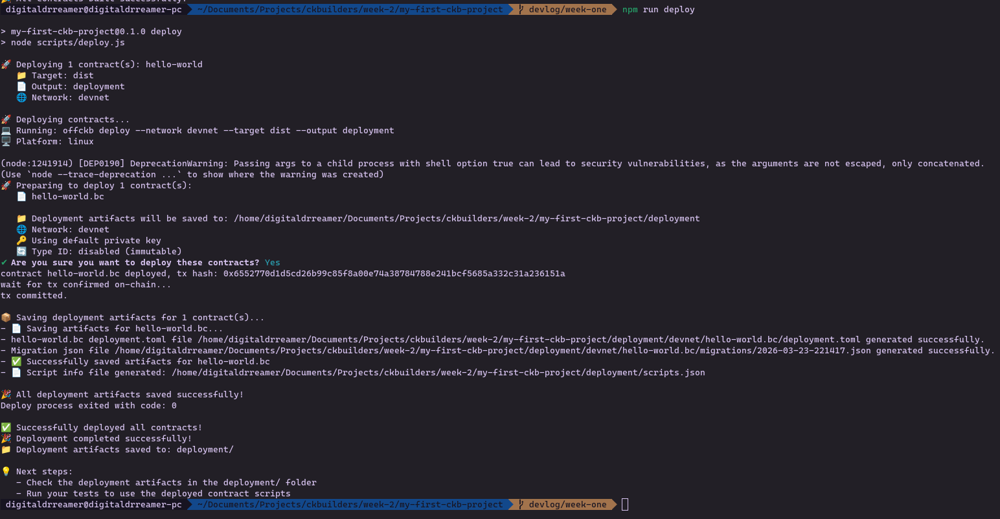

After deployment, reran tests and both suites passed.

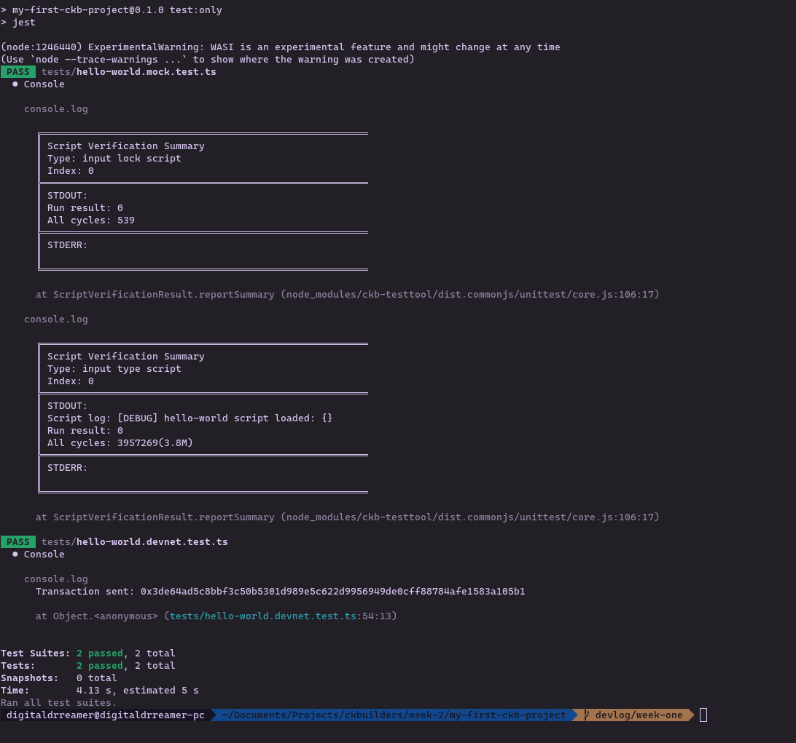

---

## CKB-VM Result and Cycle Metrics

Mock output example:

```text
Run result: 0
All cycles: 539
```

Type script output example:

```text
Script log: [DEBUG] hello-world script loaded: {}
Run result: 0
All cycles: 3957269(3.8M)
```

Interpretation:

- `Run result: 0` means successful execution in CKB-VM.
- `All cycles` indicates computational cost.
- Lock script cost (`539`) is tiny compared to type script cost (`~3.8M`), which highlights a future optimization area.

---

## Week 2 Outcome

By the end of week 2:

- Local CKB devnet is running
- Hello-world contract is compiled and deployed
- Both mock and devnet test suites pass

Next step for week 3: beginner tutorials (Transfer CKB and Store Data on Cell).

---

## References / Sources

- OffCKB docs and quick start: [offckb.com](https://offckb.com)
- Script requirements (`cargo-generate`, Clang 16): [docs.nervos.org/docs/script](https://docs.nervos.org/docs/script)
- LLVM apt repository: [apt.llvm.org](https://apt.llvm.org)
- CKB-VM cycle counting: [docs.nervos.org/docs/tech-explanation/ckb-vm](https://docs.nervos.org/docs/tech-explanation/ckb-vm)
- Additional exploratory research support: Perplexity
