Week 3 was the first week where I actually interacted with the chain rather than just setting things up. Two tutorials this week: Transfer CKB and Store Data on Cell. Both are dApp examples from the official nervos docs repo.

To grab them without cloning the entire repo I used degit:

```bash
npx degit nervosnetwork/docs.nervos.org/examples/dApp/simple-transfer simple-transfer
npx degit nervosnetwork/docs.nervos.org/examples/dApp/store-data-on-cell store-data-on-cell
```

The examples aren't in the root of the repo, they're nested inside `examples/dApp/`. Wanted to clone only the folders, so I don't bloat my git with the entire repo. degit makes this easy once you have the right path.

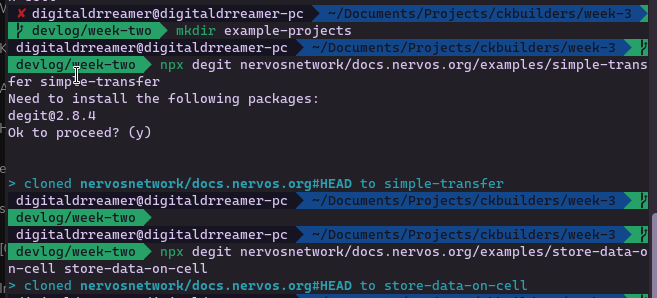

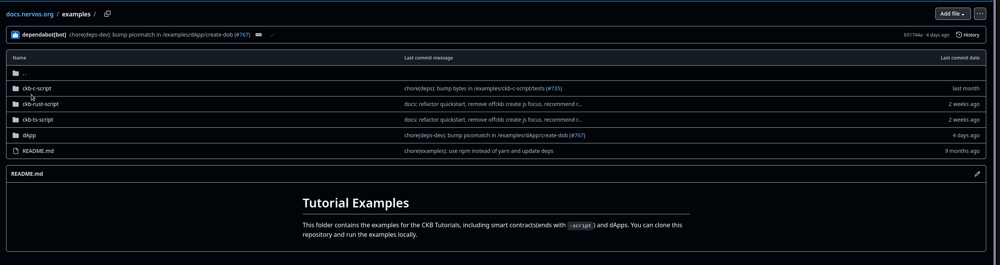

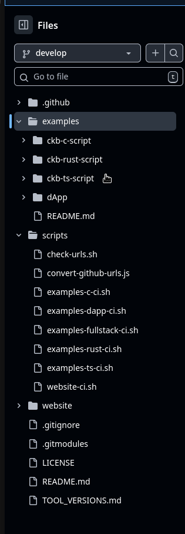

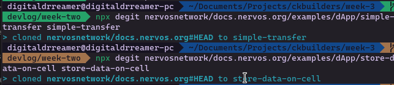

Transfer CKB

This one is a simple frontend that lets you view a wallet balance and send CKB to another address. You plug in a private key, it derives your address and shows your balance, then you fill in a recipient address and amount and hit Transfer.

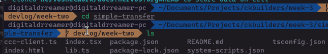

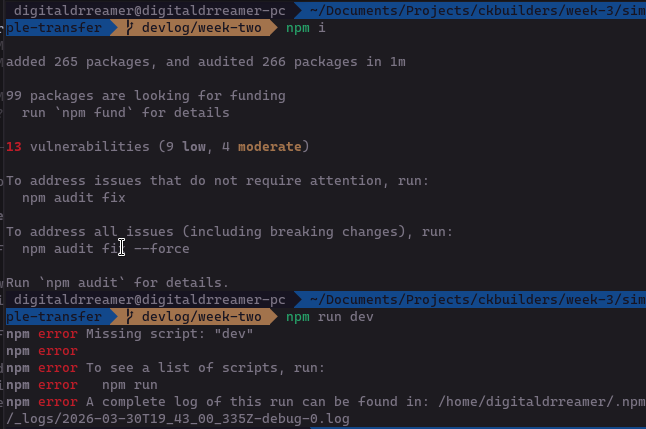

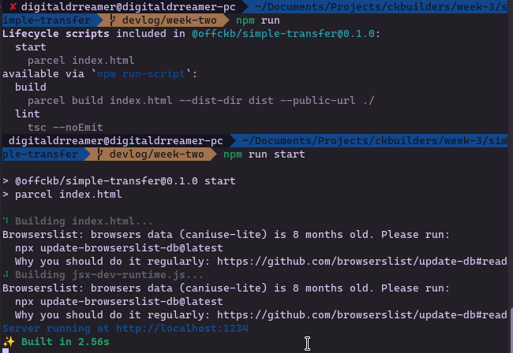

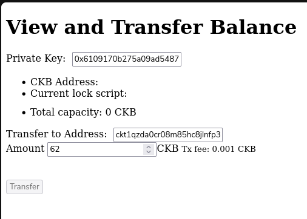

I used one of the 20 pre-funded devnet accounts that offckb provides. The balance was sitting at 896468 CKB, which makes sense since these are seeded accounts.

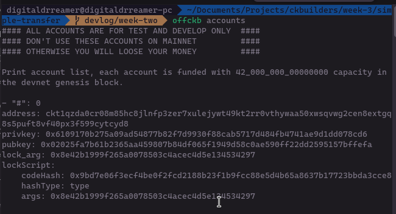

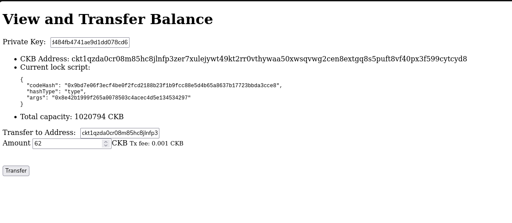

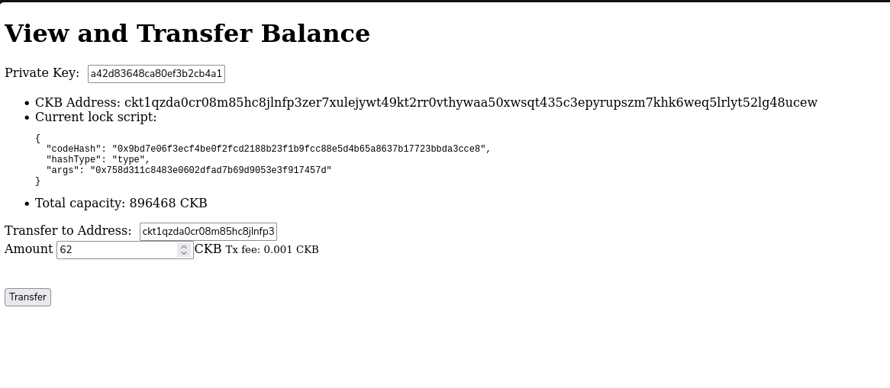

First thing I ran into was a validation error when I tried to send 10 CKB. The UI said:

```
amount must larger than 61 CKB
```

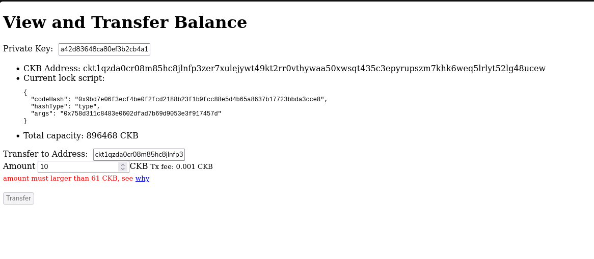

There was a "why" link next to it but it was 404ing, which is worth noting. The actual reason connects back to the Cell model though. A Cell must have enough capacity to store itself. The minimum Cell has:

- 8 bytes for the capacity field
- 32 bytes for the lock script code hash
- 1 byte for hash type
- 20 bytes for the lock args

That's 61 bytes total. And since 1 CKB = 1 byte of on-chain storage, the minimum transfer is 61 CKB. You literally cannot create a Cell that can't hold itself. The constraint isn't arbitrary, it's the storage model enforcing itself.

Sent 100 CKB to account 0. tx hash: `0x78c0725bfe71319c1e007d1f23bfab4b03312be9691d9b045961bffd00a8d95d`

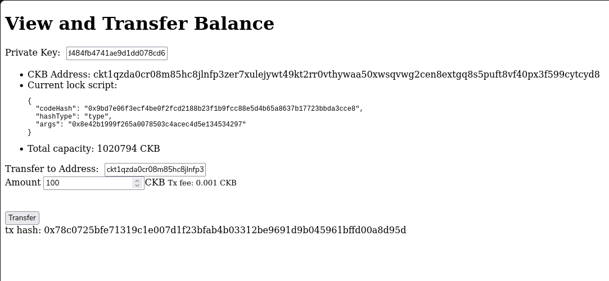

Switched to account 0's private key to confirm the balance had increased. It had.

Store Data on Cell

This one is more interesting conceptually. Same setup, private key goes in, but instead of a transfer field there's a message field. You write something, hit Write, it stores the string as raw bytes in the `data` field of a Cell on-chain. Then you hit Read to retrieve it.

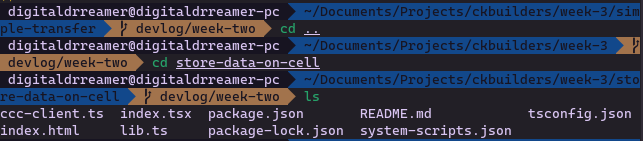

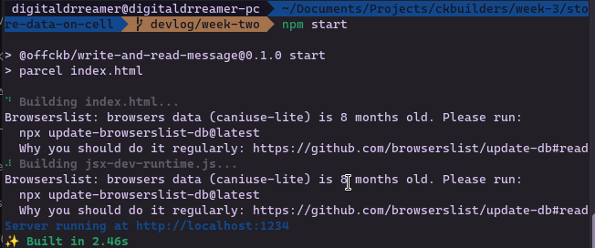

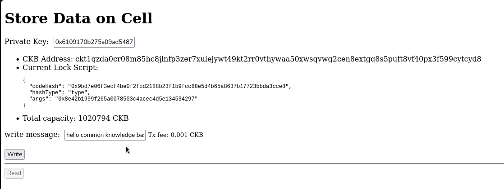

I wrote: "hehe just typing so I can see if something is actually stored. the fate of the world lies in this message."

tx hash: `0x4cc0385243938076f1a33d5c0eef2280a277e8df798391d7de97e47994c12830`

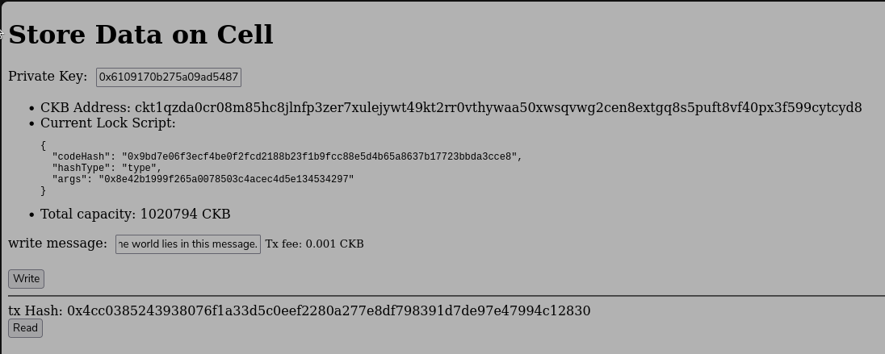

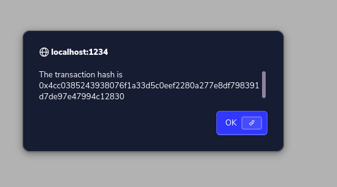

Immediately after the tx went through I hit Read and got "cell not found, please retry later". That's just because the transaction was submitted but the block hadn't been mined yet. Waited a few seconds, hit Read again, and the full message came back.

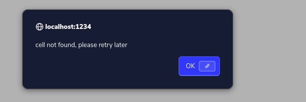

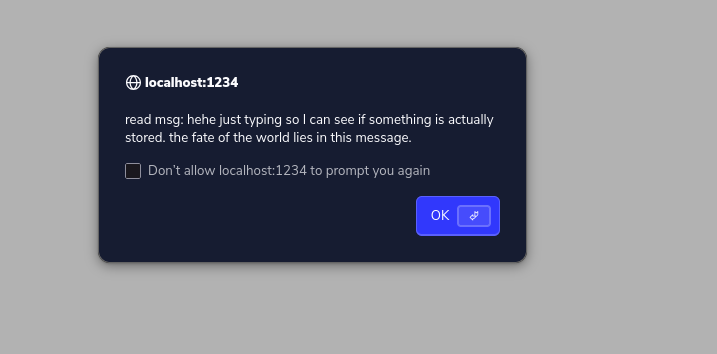

That moment is actually the Cell model clicking in a different way. This isn't a database. There's no table with a string column. The string is sitting in the `data` field of a Cell on-chain, locked to my address, and the only way to read it is to query that Cell. The data doesn't live in a contract's storage slot like it would on Ethereum. It lives in a Cell I own. Conceptually that's a big difference.

Next week is tokens and digital objects: Create Fungible Token and Create DOB.


Refs/Sources
Simple transfer example - github.com/nervosnetwork/docs.nervos.org/examples/dApp/simple-transfer
Store data on cell example - github.com/nervosnetwork/docs.nervos.org/examples/dApp/store-data-on-cell
61 CKB minimum explained - docs.nervos.org/docs/wallets/#requirements-for-ckb-transfers (currently 404ing)
Cell model capacity rules - docs.nervos.org/docs/getting-started/how-ckb-works
Perplexity for research