Week 4 was tokens and digital objects. Two tutorials, plus some poking around the CCC Playground and CKB Tools.

Same degit setup as last week:

```bash
npx degit nervosnetwork/docs.nervos.org/examples/dApp/xudt xudt
npx degit nervosnetwork/docs.nervos.org/examples/dApp/create-dob create-dob
```

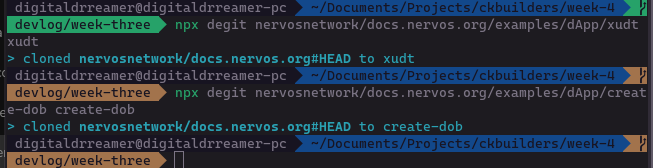

xUDT — Fungible Tokens

The xUDT dApp lays the whole flow out on one page. Step 1 issue, Step 2 view, Step 3 transfer. Nice and linear.

Plugged in a devnet private key, balance came up as 860518 CKB. Set amount to 80 and issued.

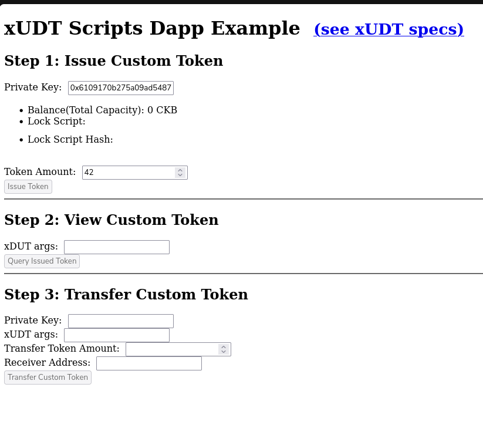

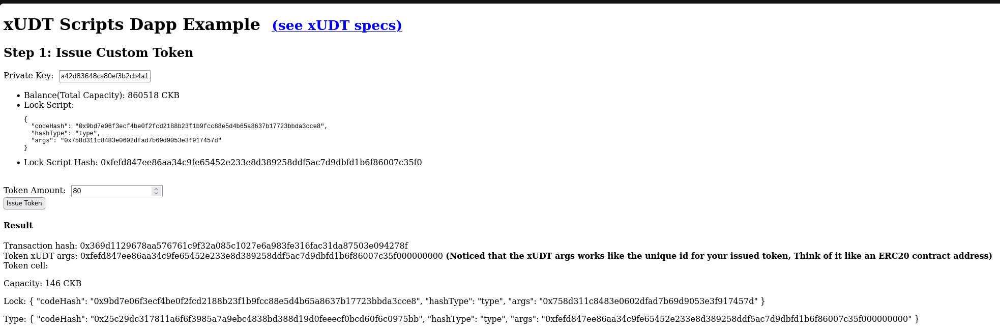

```
Transaction hash: 0x369d1129678aa576761c9f32a085c1027e6a983fe316fac31da87503e094278f
Token xUDT args: 0xfefd847ee86aa34c9fe65452e233e8d389258ddf5ac7d9dbfd1b6f86007c35f000000000
```

The UI calls out something useful here. The xUDT args work like a unique token ID, and its the Lock Script Hash of whoever issued it. On Ethereum a token is identified by the contract that manages it. On CKB theres no shared contract. The token type is baked into the Cell's type script, and the issuer's lock hash is what makes it unique. Different person issues the same "token", different ID. It's a fundamentally different model.

Queried it in Step 2:

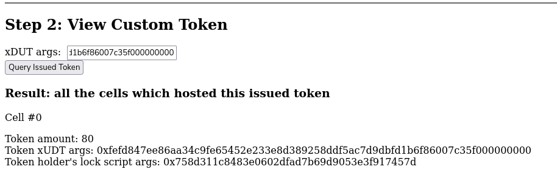

```
Cell #0
Token amount: 80
Token holder's lock script args: 0x758d311c8483e0602dfad7b69d9053e3f917457d
```

Then transferred 16 tokens to another account. Went through fine.

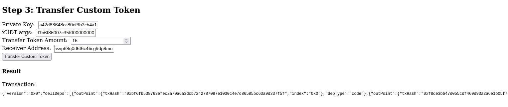

DOB — Digital Objects (Spore)

Now this one is different. Spore lets you mint digital objects on-chain. Not a pointer to an image, not an IPFS hash. The actual content, living inside the Cell's data field.

First attempt I uploaded a large image and hit Create DOB. Got this:

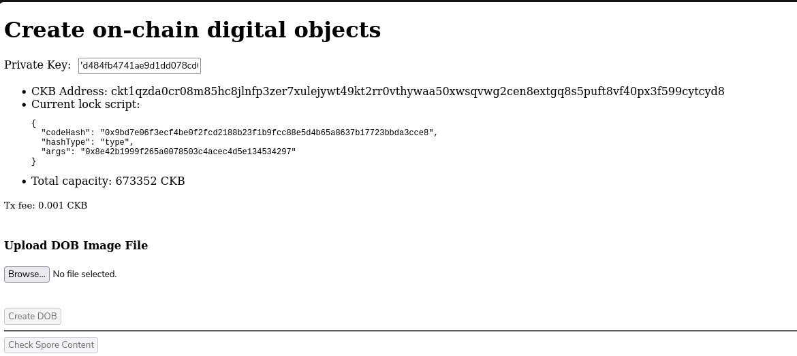

```
Unhandled Rejection (Error): Expected the transaction size to be <= 512000, actual size: 661768
```

CKB has a 512KB transaction size limit. Makes sense when you think about it — the image has to fit inside the transaction itself, not just be referenced by it. That's the tradeoff. True on-chain storage means the chain actually has to hold the bytes.

Switched to a smaller image, `goremote-with-white-text-transparent-bg.png` at 68939 bytes.

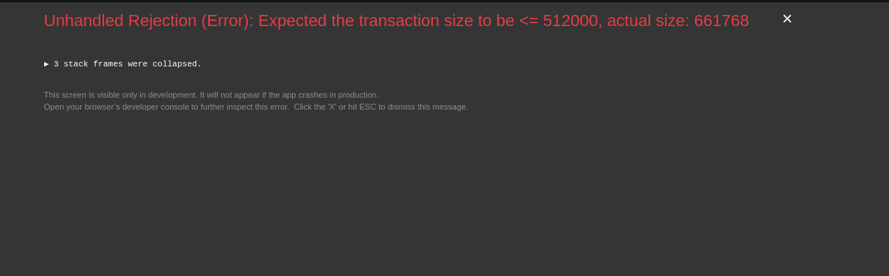

Second attempt hit a network error.


Not sure what caused that one. Devnet was still running, nothing had changed. Restarted it anyway and tried again.

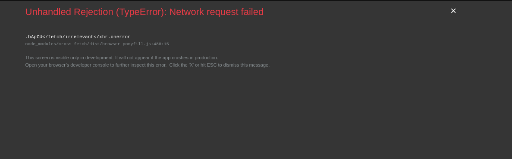

```
tx Hash: 0xba77bf19cca8f8bc17843490b38c9b5484d0f8b5a7fc29fec66435f8ce2ae1d6
```

Hit Check Spore Content and the image rendered directly in the browser.

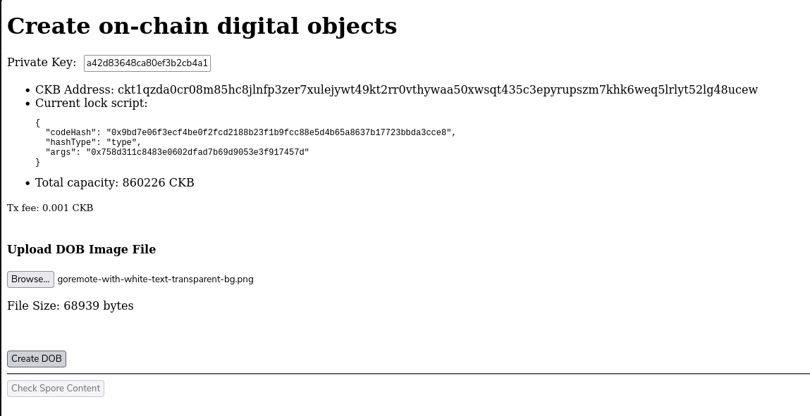

```
contentType: image/jpeg
```

That's it. The image came back off the chain. Not from a server, not from IPFS, from the Cell. This is what makes Spore different from basically every other NFT implementation. On Ethereum an NFT is usually a token ID pointing at a metadata URL pointing at an image hosted somewhere. If the server goes down the NFT is just a number. With Spore the content IS the Cell. There's nowhere for it to go.

CCC Playground

Spent time on https://live.ckbccc.com. The default example builds a transfer transaction step by step. But what's actually useful about the playground is the right panel — it visualises the transaction as its built, showing Cells as shapes with their capacities. You watch inputs get consumed and outputs appear in real time as each line executes.

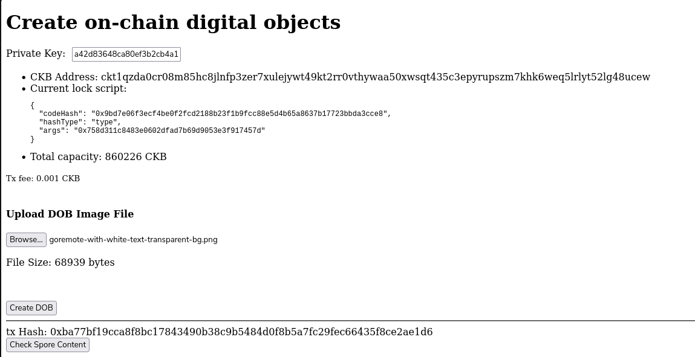

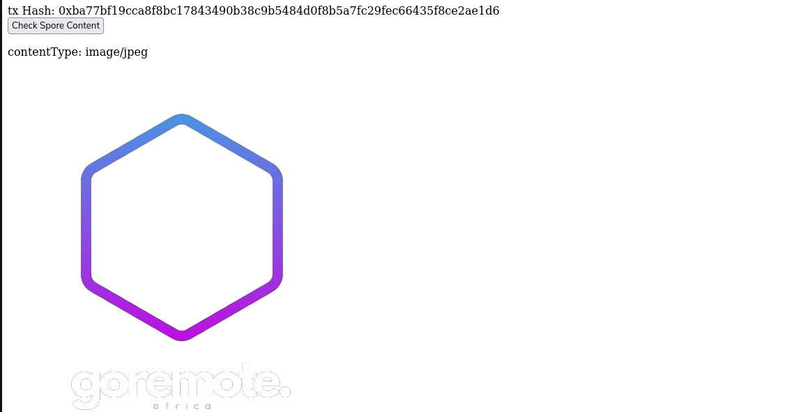

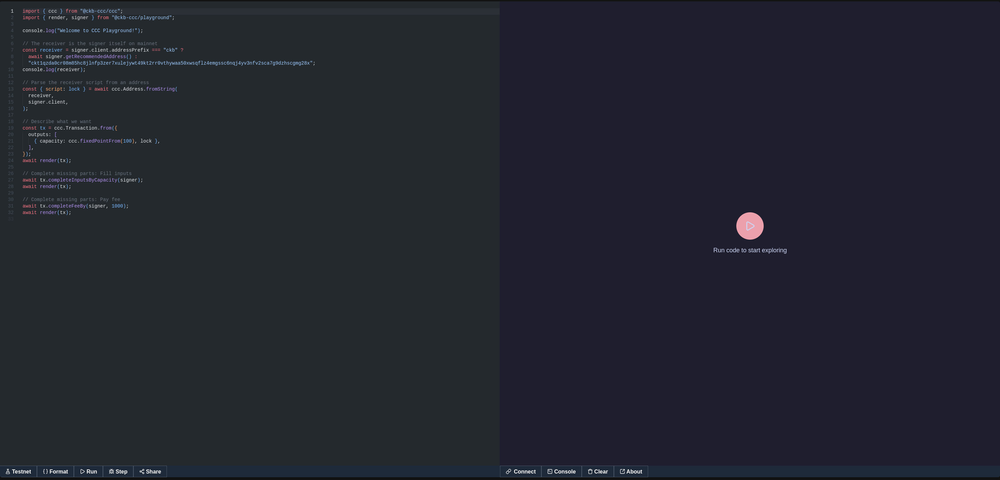

The Cell consumption model clicked differently watching it visually than reading about it. Cells go in, Cells come out. Change Cell, fee Cell. Its the same logic as cash but you can actually see it.

CKB Tools

Checked out https://ckb.tools. Address inspector, bootstrap data, key generator, SUDT tool.

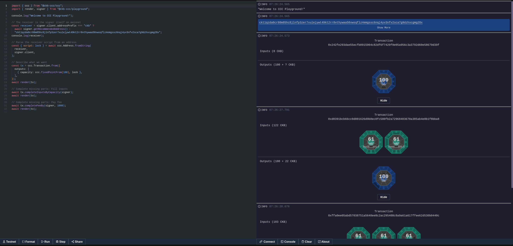

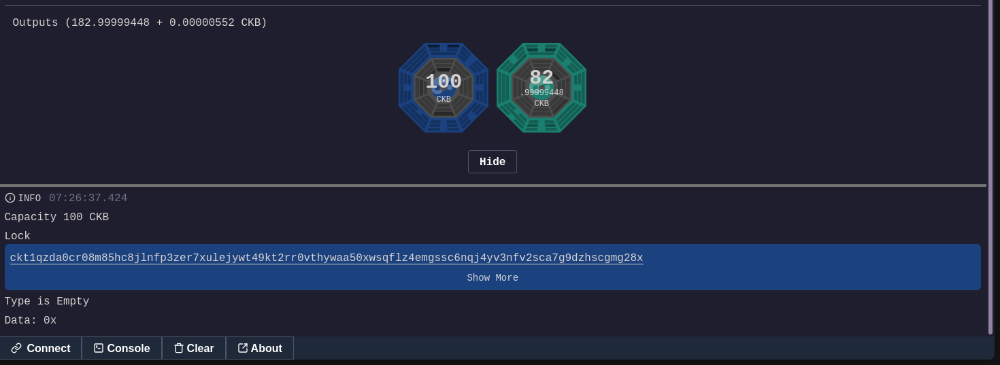

Worth noting it still references MetaMask and PW-SDK which are both older patterns. The ecosystem has moved to CCC and Omnilock. Still useful for quick keypair generation and address inspection but probably not where active development happens anymore.

Next week is Build a Simple Lock.


Refs/Sources
xUDT tutorial - docs.nervos.org/docs/dapp/create-token
Spore/DOB tutorial - docs.nervos.org/docs/dapp/create-dob
CCC Playground - live.ckbccc.com
CKB Tools - ckb.tools
Spore Protocol - docs.spore.pro
Perplexity for research

Note: I missed the last hackathon, but I'm working on documentation for my first project on CKB.