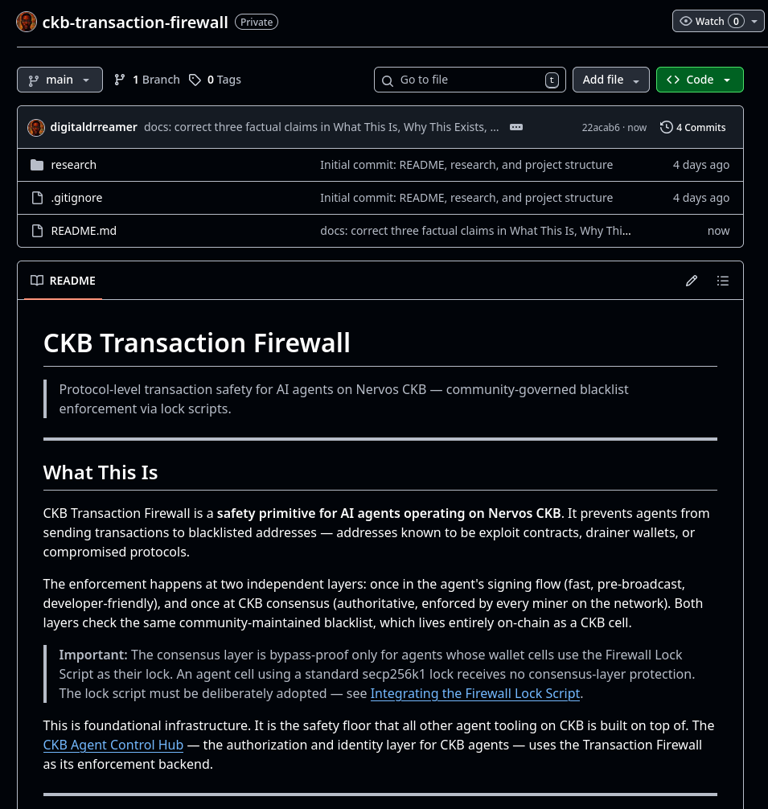
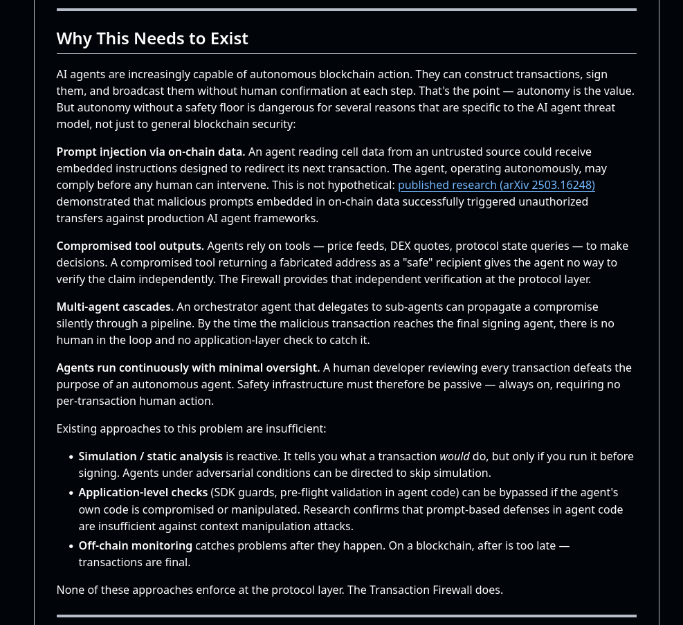
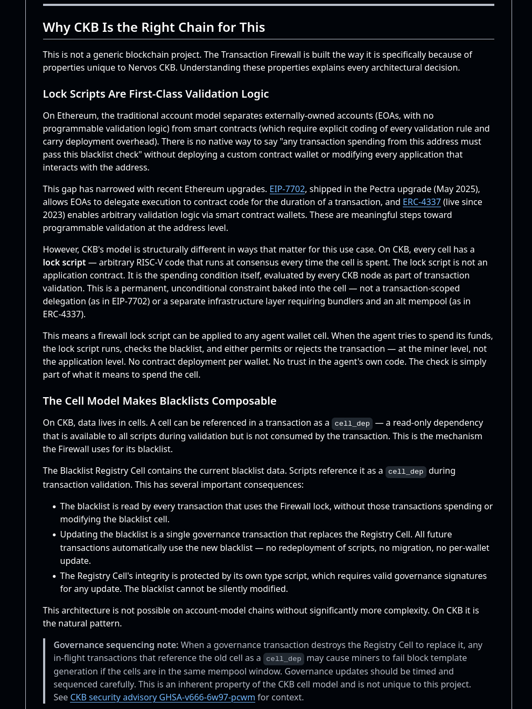
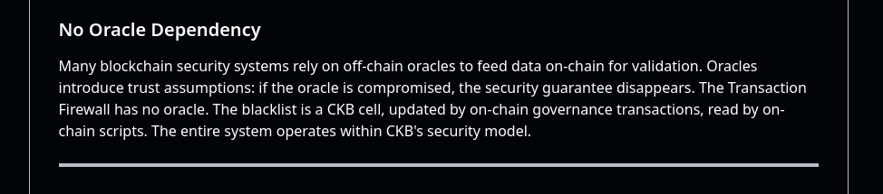

Week 5 was not a tutorial week. I was busy thinking about ideas in my head, and writing them down.

The beginner app decision had been sitting in the back of my head since week 4 and this week I just went all in on it. Two projects: CKB Transaction Firewall and CKB Agent Control Hub. Both sitting in private repos for now, will make them public once there's something worth showing.

The planning was thorough. Full system design, architectural decisions, library syntax outlined, the whole thing documented before a single line of code. I hate starting to build and then realising halfway through that a decision I made early was wrong. SO the goal was to front-load all the thinking so as little as possible changes once I actually start writing Rust.

Most of that writing landed first in the **CKB Transaction Firewall** private repo README — repo landing, problem framing, why CKB fits the design, and how the blacklist stays fully on-chain without oracles. There's still a lot more, but here are snippets.

CKB Agent Control Hub has the same “design before code” treatment in its own repo; no screenshots for that one this week.

Drew from prior work too. Veiled Auth, my ZK-based pseudonymous auth system I built earlier this year, had some identity and nullifier design patterns that map cleanly into parts of the Control Hub's identity layer. Good to not be starting from zero.

The conversation that changed the most this week was with RobairEth, a developer in the Nervos ecosystem whose project Nerve came second in the Claw & Order CKB AI Agent Hackathon that concluded this week. We talked through CKB history and he walked me through parts of how Nerve works architecturally.

I had been planning to put a middleware layer between the agent and the chain to enforce Firewall rules. An off-chain SDK guard basically. RobairEth reminded me lock scripts exist. And that's the point — enforcement that lives off-chain can be bypassed if the agent's own code is compromised or manipulated. Lock scripts run on every transaction that spends the agent's wallet cells, validated by every miner on the network. There's no bypassing that. SO the entire enforcement architecture shifted on-chain because of that one conversation.

That's the kind of thing you don't get from just reading docs. The instinct to reach for middleware comes from years of building on account-model chains where that's just how you do things. Someone who's actually built on CKB short-circuits that in a sentence.

Simple Lock tutorial and the L1 course reading got deprioritised this week. They'll carry into next week.

Refs/Sources
Claw & Order hackathon results - talk.nervos.org/t/claw-order-ckb-ai-agent-hackathon-results/10173
CKB lock script docs - docs.nervos.org/docs/script
ckb-std Rust library - github.com/nervosnetwork/ckb-std
Spore Protocol - docs.spore.pro
Veiled Auth — prior ZK identity work
